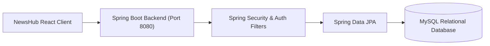
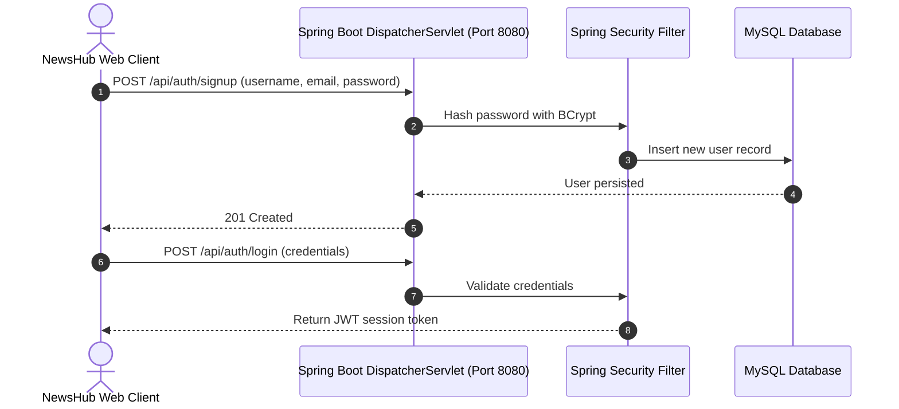

# NewsHub Enterprise Backend — Spring Boot Service
[]()
[]()
[]()
[]()

## Overview
The enterprise backend authentication, user bookmark synchronization, and administrative service for the NewsHub news ecosystem. Implemented in Java 17 using Spring Boot, Spring Security, and MySQL, it provides user profiles, saved story cloud syncing, and administrative account oversight.

- **Problem Solved:** Centralized user profile management and multi-device article bookmark syncing.
- **Target Users:** NewsHub web and mobile clients.
- **Current Status:** Functional Microservice API.

## Features
- **User Authentication:** Registration, login, and token issuance.
- **Saved Article Sync:** Cloud synchronization of bookmarked news across user devices.
- **Admin Dashboard APIs:** User activity auditing and role assignment.
- **Containerization:** Packaged with Dockerfile and startup orchestration scripts.

## Architecture


## User Flow


## Technology Stack
| Layer | Technology | Purpose |
|---|---|---|
| Language | Java 17 | Core enterprise backend language |
| Framework | Spring Boot 3 | Web MVC and security framework |
| Persistence | Spring Data JPA, Hibernate | Object-relational mapping |
| Database | MySQL 8.0 | User profiles and bookmark storage |
| Container | Docker | Containerized service packaging |

## Infrastructure
- **Service Port:** 8080
- **Database Port:** 3306

## Project Structure
```text
news-backend/
├── src/main/java/com/klu/news/
│   ├── controller/      # AuthController, UserController, AdminController
│   ├── entity/          # User, Bookmark entities
│   ├── repository/      # Spring Data JPA repositories
│   └── service/         # Business logic services
├── Dockerfile           # Docker container packaging
├── pom.xml              # Maven dependencies
├── .gitignore           # Git ignore definitions
└── README.md            # Technical documentation
```

## Prerequisites
- JDK 17
- Maven >= 3.8
- MySQL Server 8.0

## Environment Variables
Configure in `application.properties`:
```properties
SPRING_DATASOURCE_URL=jdbc:mysql://localhost:3306/news_db
SPRING_DATASOURCE_USERNAME=root
SPRING_DATASOURCE_PASSWORD=your_mysql_password
```

## Local Development Setup
1. Clone the repository:
   ```bash
   git clone https://github.com/Bhanutejanallamothu/news-backend.git
   cd news-backend
   ```
2. Run database initialization in MySQL:
   ```sql
   CREATE DATABASE news_db;
   ```
3. Start the application:
   ```bash
   ./mvnw spring-boot:run
   ```

## Docker Setup
Build and run Docker container:
```bash
docker build -t news-backend .
docker run -p 8080:8080 news-backend
```

## Database Setup
Tables automatically generated by Hibernate DDL auto update.

## API Documentation
- `POST /api/auth/signup` - Register user.
- `POST /api/auth/login` - User login.
- `GET /api/admin/users` - Admin user list.

## Deployment
Deployable on AWS ECS, Render, or Kubernetes clusters.

## Security
- Passwords hashed with BCrypt.
- Parameterized SQL execution.

## Testing
```bash
./mvnw test
```

## Troubleshooting
- Check MySQL connection string if application fails on boot.

## Future Improvements
- Automated push notification dispatcher for breaking news alerts.

## License
All rights reserved by repository owner.
